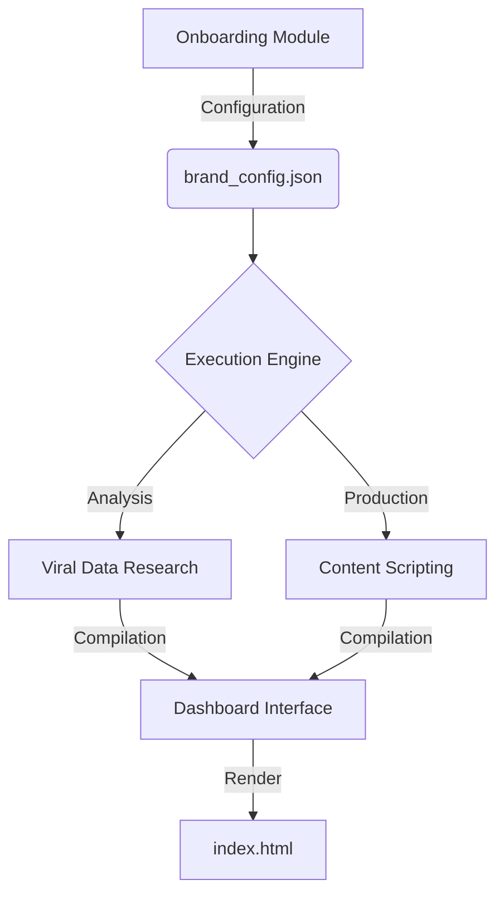

# CONTENT ENGINE // BRAND ARCHITECTURE
> **A streamlined framework for personal branding and viral content strategy.**


---

## Overview
Content Engine is an automated framework designed to help creators and entrepreneurs build a data-driven personal brand. It bridges the gap between raw social data and production-ready content scripts by analyzing performance trends within specific niches.

### Modular Architecture


### Core Capabilities
- **Interactive Onboarding**: Custom interface to define brand identity and core positioning.
- **Viral Research**: Automated data extraction from YouTube, Instagram, and LinkedIn.
- **Strategic Scripting**: Logic-driven content scripts mapped to successful viral hooks.
- **Reporting Dashboard**: Visual interface for managing and reviewing brand strategy.

---

## Output Previews

### Onboarding Interface

*Initial phase: Defining brand foundation and market niche.*

### Strategy Generation

*Configuration phase: Generating target personas and keyword maps.*

### Analytical Dashboard

*The centralized dashboard for strategy management.*

### Research Analysis

*Detailed performance analysis across primary social platforms.*

### Content Deliverables

*Script outputs mapped to high-performance content structures.*

---

## Operation Workflow
The system utilizes a structured onboarding process to ensure configuration accuracy:

1. **Niche Definition**: Define the specific area of focus.
2. **Prompt Generation**: The system provides a specialized configuration prompt.
3. **External Analysis**: Utilize the prompt with an LLM of choice (GPT-4, Claude 3.5).
4. **Data Import**: Re-import the structured response into the interface.
5. **System Synchronization**: Local configuration updates automatically across all modules.

---

## Technical Stack
- **Interface**: HTML5, CSS3, JavaScript.
- **Automations**: Python 3.10+.
- **Intelligence**: Integrated Large Language Models.
- **Data Sources**: Platform APIs and custom extraction logic.

---

## Quick Start

### 1. Configuration
Open `brand_questionnaire.html` in a browser to generate the local `brand_config.json`.

### 2. Environment Setup
Install the required dependencies:
```bash
pip install -r requirements.txt
```

### 3. Credentialing
Configure the `.env` file with the necessary access tokens:
```env
OPENAI_API_KEY=your_key_here
YOUTUBE_API_KEY=your_key_here
INSTAGRAM_ACCESS_TOKEN=your_key_here
```

### 4. Execution
Run the orchestrator to begin research and script generation:
```bash
# Execute viral research module
python execution/viral_research.py

# Compile deliverables and dashboard
python execution/compile_deliverable.py
```

### 5. Access
Launch `index.html` to view the finalized strategy.

---

## System Architecture


---

## API Requirements

| Module | Integration | Access Point |
| :--- | :--- | :--- |
| YouTube | Platform API | Google Cloud Console |
| Intelligence | API Key | OpenAI / Anthropic |
| Instagram | Graph API | Meta for Developers |
| LinkedIn | Custom / API | LinkedIn Developer Portal |

> [!TIP]
> Third-party bridges can be utilized for platform access when official API provisioning is pending.

---

## Directory Structure
```text
├── brand_questionnaire.html  # Configuration Interface
├── index.html                # Management Dashboard
├── brand_config.json         # Local Brand Identity
├── execution/                # System Orchestrators
├── SKILLS/                   # Modular Capabilities
└── examples/                 # Reference Templates
```

---

## Contributing
Project improvements and feature additions are welcome.

1. Fork the repository.
2. Create a feature branch (`git checkout -b feature/improvement`).
3. Commit changes (`git commit -m 'Initial descriptive message'`).
4. Push to the branch (`git push origin feature/improvement`).
5. Open a Pull Request.

---

## License
Distributed under the MIT License. Reference `LICENSE` for details.

---
**Dedicated to Personal Brand Architects.**
