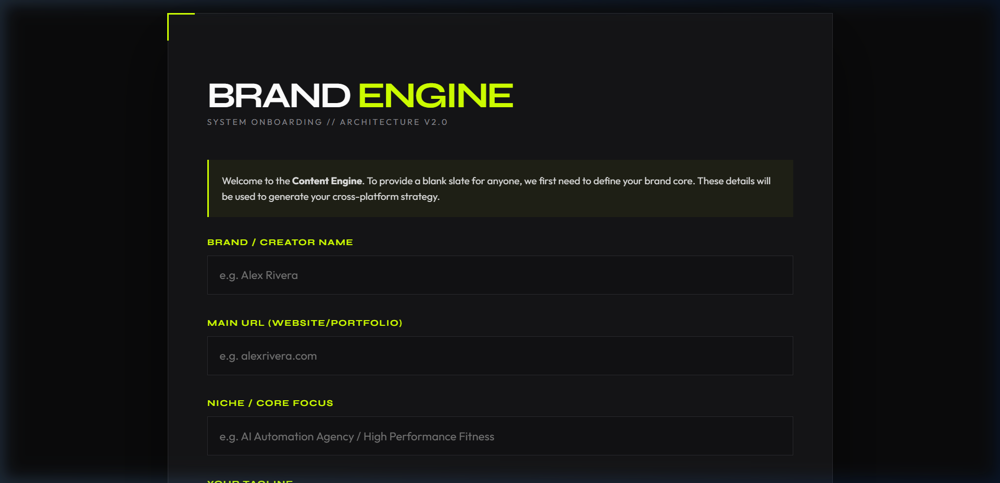
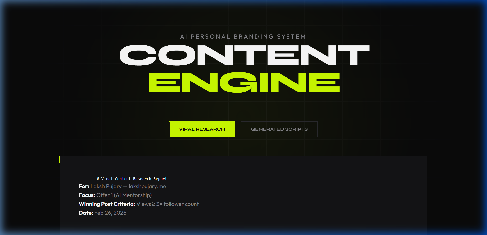
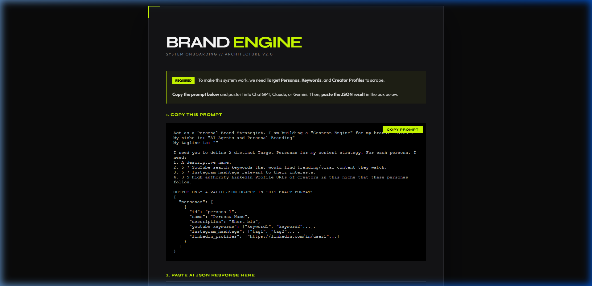
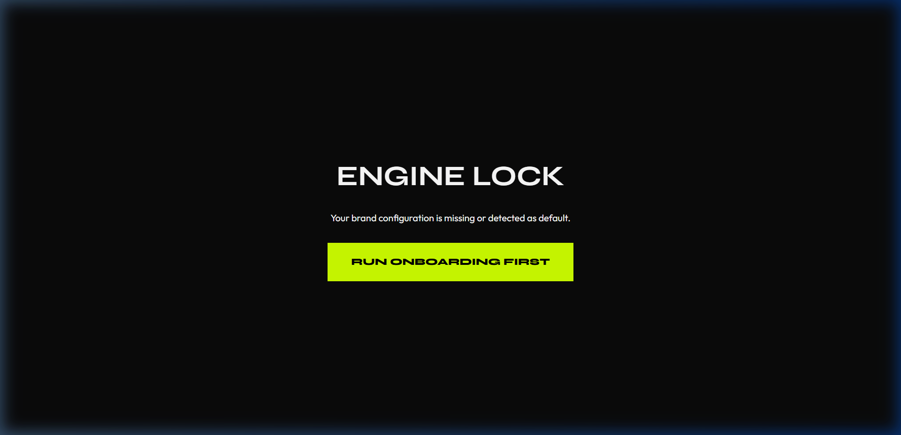
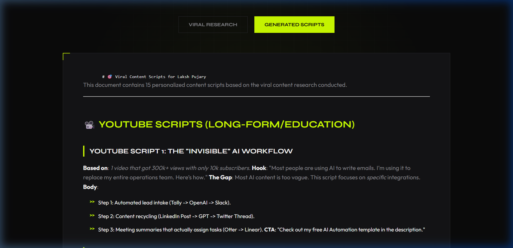
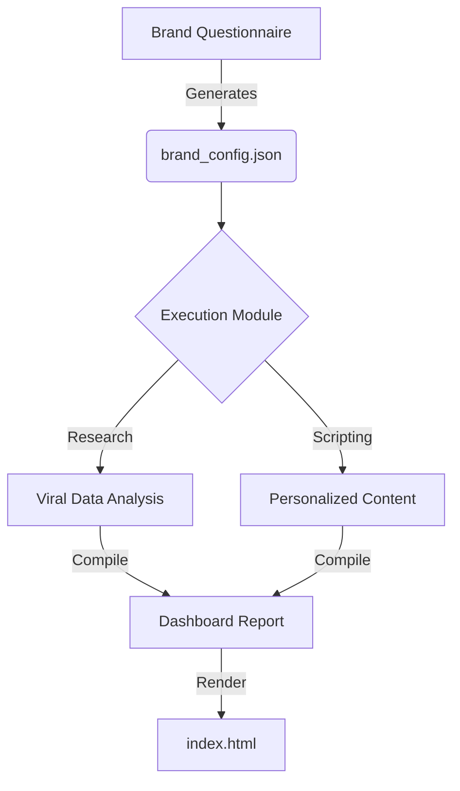

# ⚡ Content Engine // Brand Architecture
> **The AI-powered command center for personal branding and viral content strategy.**




---

## 🎯 What is Content Engine?
Content Engine is a dynamic framework designed to help creators and entrepreneurs build a data-driven personal brand. It bridges the gap between **raw social data** and **ready-to-post content scripts** by leveraging AI to analyze what actually works in your niche.

### Modular Architecture


### Core Features:
- 🛠️ **Interactive Onboarding**: A custom HTML questionnaire to define your brand identity.
- 📉 **Viral Research**: Automated extraction of top-performing content across YouTube, Instagram, and LinkedIn.
- ✍️ **AI Scripting**: Personalized content scripts that maintain your unique brand voice.
- 🖥️ **Premium Dashboard**: A sleek, dark-mode visual interface to manage your brand strategy.

---

##  Final Output Previews

### Brand Onboarding

*Step 1: Define your brand's core foundation and niche.*

### AI Strategy Engine

*Step 2: Use the built-in AI Prompt Bridge to generate your target personas and keywords.*

### Strategy Dashboard

*The Dashboard locks until your configuration is finalized.*

### Viral Research Report

*Detailed analysis of viral content across social platforms.*

### AI-Generated Content Scripts

*Personalized scripts mapped to successful viral hooks.*

---

## 🔮 The AI Strategy Bridge
To make this a truly "blank slate" system, the onboarding process includes a **Direct AI Bridge**. 

1. **Input Your Niche**: Tell the engine what you do.
2. **Copy the Prompt**: The engine generates a specialized prompt for you.
3. **Prompt any AI**: Paste that prompt into ChatGPT, Claude, or Gemini.
4. **Import JSON**: Paste the AI's response back into the questionnaire.
5. **Auto-Configure**: The engine instantly updates your `brand_config.json` with target personas, keywords, and competitor profiles.

---

## 🛠️ Tech Stack
- **Dashboard**: Vanilla HTML5, CSS3 (Glassmorphism), JavaScript (Data-Driven).
- **Automation**: Python 3.10+ (Data Processing & AI Orchestration).
- **AI**: OpenAI GPT-4 / Claude 3.5 Sonnet.
- **Data**: YouTube Data API v3, Instagram Graph API, LinkedIn API.

---

## 🚀 Quick Start (In 5 Minutes)

### 1. Define Your Brand
Open `brand_questionnaire.html` in your browser. Complete the steps to generate your `brand_config.json`.

### 2. Install Dependencies
```bash
pip install -r requirements.txt
```

### 3. Setup Environment
Create a `.env` file in the root directory:
```env
OPENAI_API_KEY=sk-...
YOUTUBE_API_KEY=...
INSTAGRAM_ACCESS_TOKEN=...
```

### 4. Run the Engine
```bash
# Research trending content
python execution/viral_research.py

# Generate report and scripts
python execution/compile_deliverable.py
```

### 5. View Dashboard
Open `index.html` to see your new strategy alive!

---

## 📊 System Workflow


---

## 🔑 API Setup Guide

| Platform | Difficulty | Where to Get |
| :--- | :--- | :--- |
| **YouTube** | Easy | [Google Cloud Console](https://console.cloud.google.com/) |
| **OpenAI** | Easy | [OpenAI Platform](https://platform.openai.com/) |
| **Instagram** | Medium | [Meta for Developers](https://developers.facebook.com/) |
| **LinkedIn** | Hard | [LinkedIn Developer Portal](https://developer.linkedin.com/) |

> [!TIP]
> For LinkedIn and Instagram, you can use third-party scraping bridges if official API access is delayed.

---

## 📂 Project Structure
```text
├── brand_questionnaire.html  # Onboarding Interface
├── index.html                # Main Dashboard
├── brand_config.json         # Your Brand Identity (Generated)
├── execution/                # Core Python Orchestrators
├── SKILLS/                   # Modular AI Capabilities
└── examples/                 # Reference Data & Templates
```

---

## 🤝 Contributing
Contributions are what make the open-source community such an amazing place to learn, inspire, and create. Any contributions you make are **greatly appreciated**.

1. Fork the Project
2. Create your Feature Branch (`git checkout -b feature/AmazingFeature`)
3. Commit your Changes (`git commit -m 'Add some AmazingFeature'`)
4. Push to the Branch (`git push origin feature/AmazingFeature`)
5. Open a Pull Request

---

## ⚖️ License
Distributed under the MIT License. See `LICENSE` for more information.

---
**Built with ❤️ for Personal Brand Architects.**
